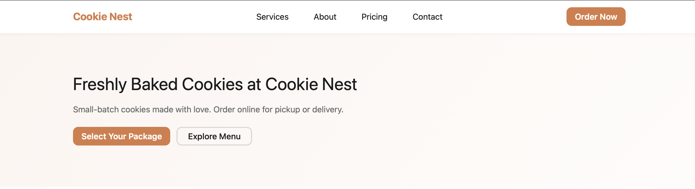
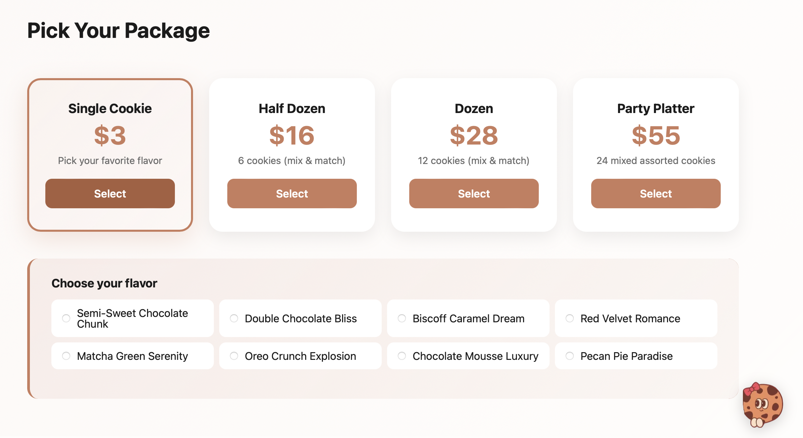
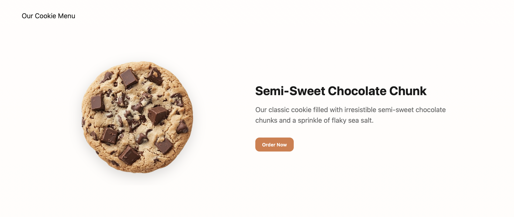
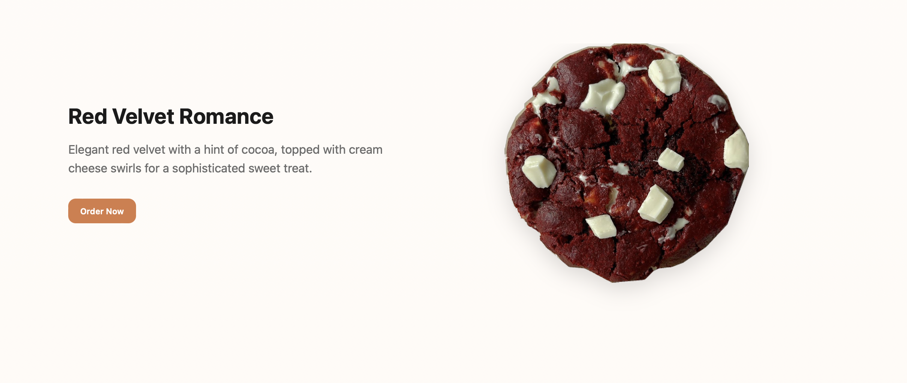
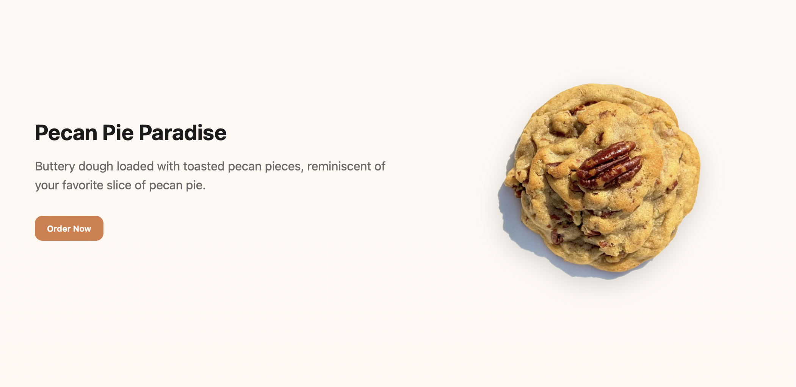

# Cookie Nest — Landing Page

This project is a simple landing page created for Lab 2 (Web Programming). The website represents a small cookie business called Cookie Nest and includes basic sections such as hero, about, pricing, and contact.

## Overview

Cookie Nest is a modern e-commerce landing page built entirely with **vanilla HTML, CSS, and JavaScript**. The site features:

- **Hero Section** with call-to-action buttons
- **Interactive Pricing System** where customers can select their desired package (Single, Half Dozen, Dozen, Party Platter)
- **Detailed Cookie Menu** displaying 8 unique cookie varieties with images and descriptions
- **About Section** explaining the bakery's moto
- **Contact Form** for customer inquiries

### Project Structure
```
tum-web-lab2/
├── index.html
├── styles/
│   ├── reset.css
│   └── style.css
├── cookies/
│   └── [8 cookie images]
├── screenshots/
│   └── [project screenshots]
└── README.md
```

## Screenshots

### Hero Section

The hero section showcases the main call-to-action with navigation.

### Pricing & Package Selection

Interactive cards where customers select their preferred package with real-time feedback.

### Cookie Menu Examples

Cookie images used to showcase different flavors in the menu section of the website.










### Order Summary


Real-time order summary that updates when customers select a package.
