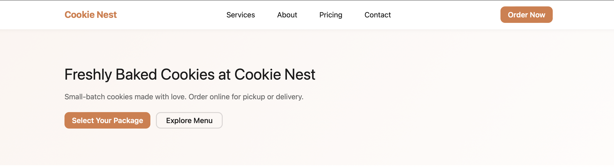
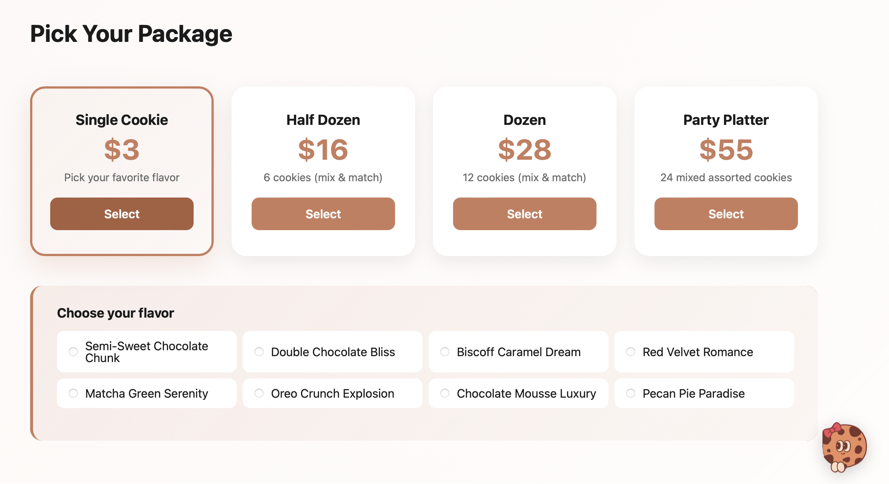
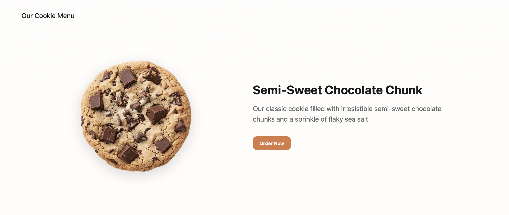
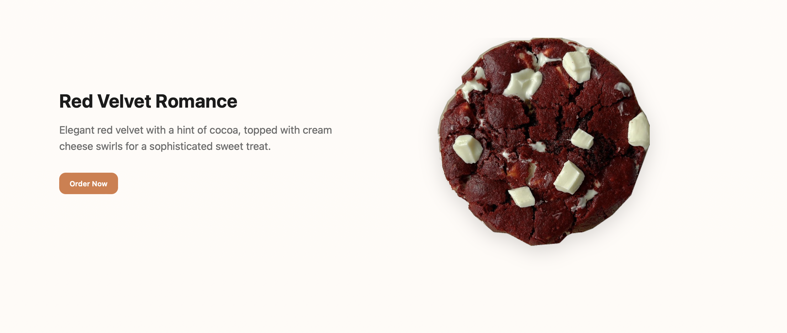
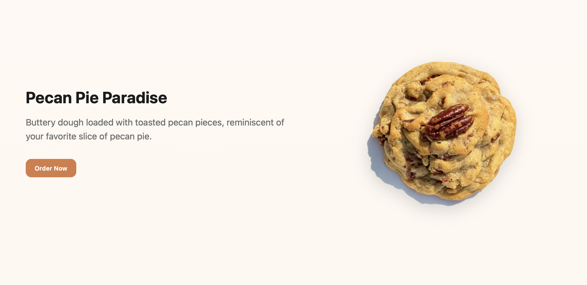
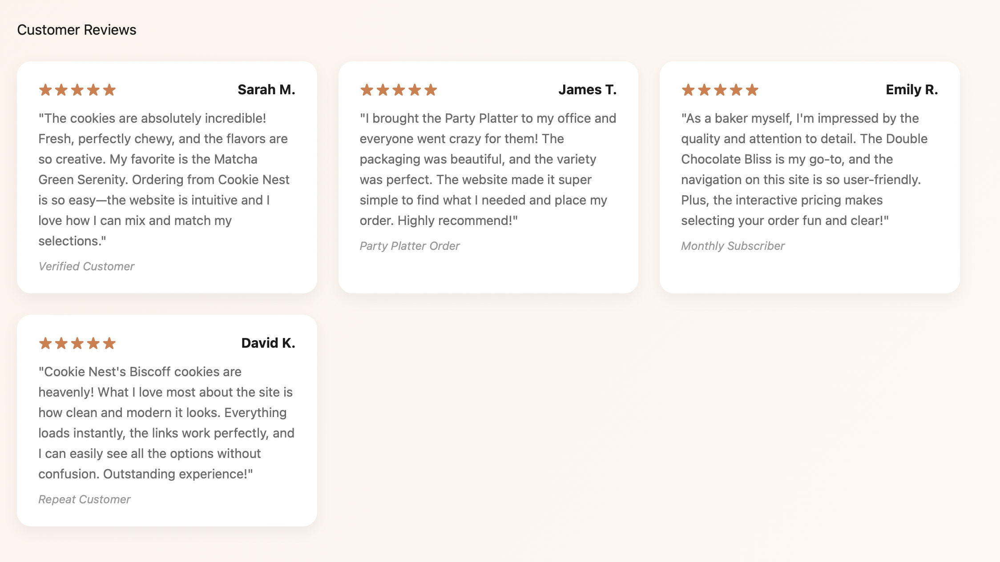
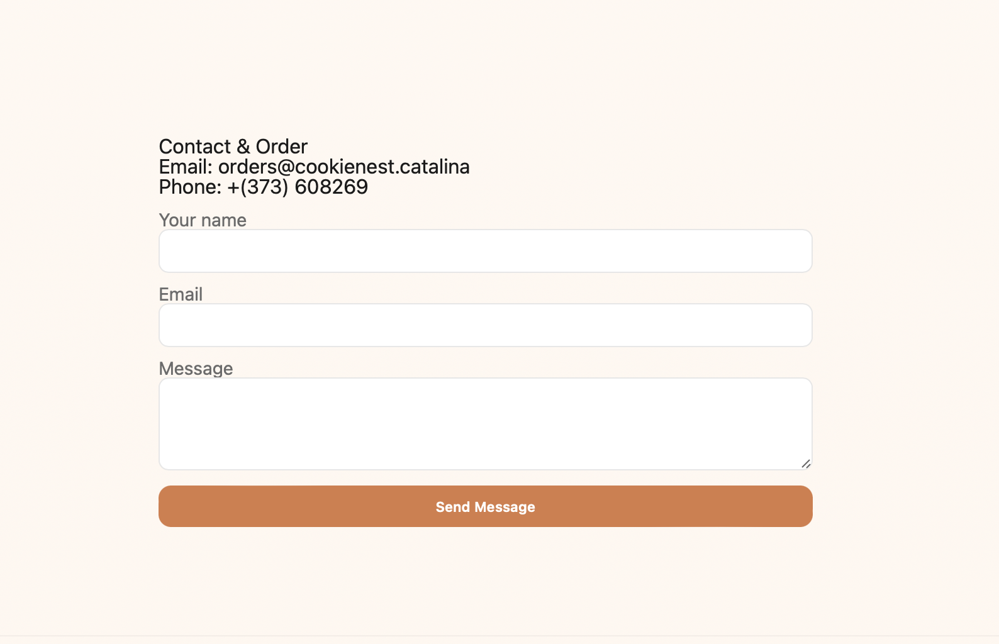
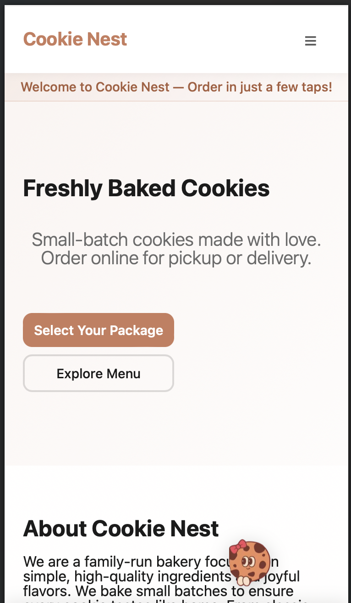
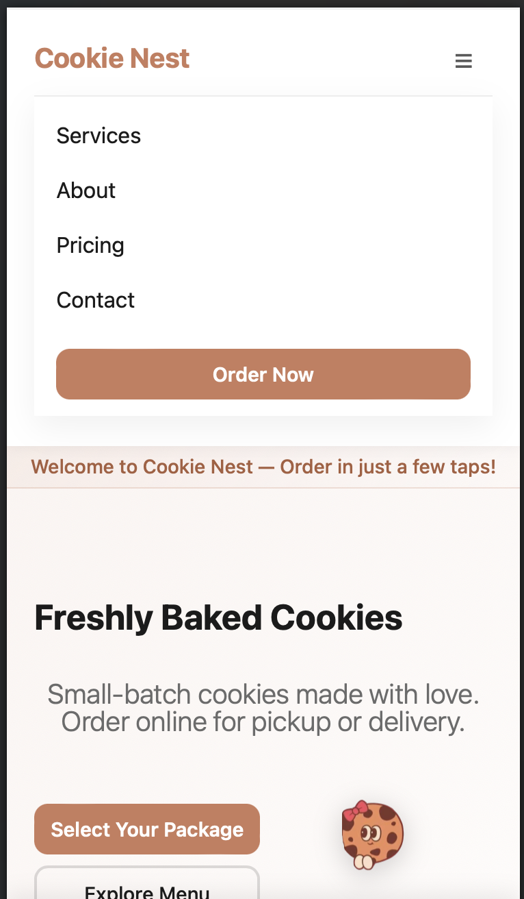
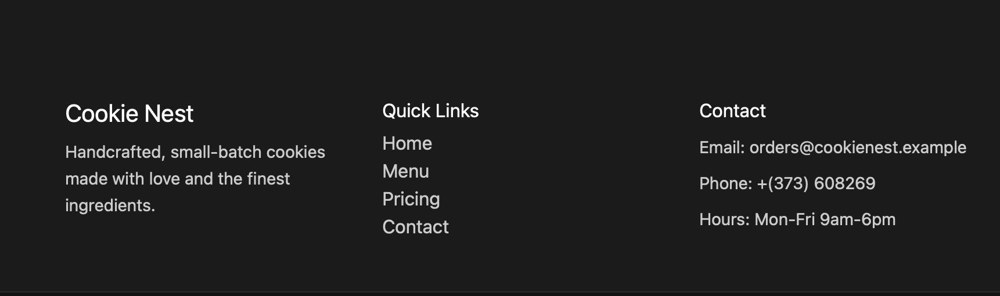

# Cookie Nest — Landing Page

This project is a simple landing page created for Lab 2 (Web Programming). The website represents a small cookie business called Cookie Nest and includes basic sections such as hero, about, pricing, and contact.

## Live Demo Video

**[Cookie Website Live Demo](https://cookienest.netlify.app)**


## Overview

Cookie Nest is a modern e-commerce landing page built entirely with **vanilla HTML, CSS, and JavaScript**. The site features:

- **Hero Section** with call-to-action buttons
- **Interactive Pricing System** where customers can select their desired package (Single, Half Dozen, Dozen, Party Platter)
- **Detailed Cookie Menu** displaying 8 unique cookie varieties with images and descriptions
- **About Section** explaining the bakery's moto
- **Contact Form** for customer inquiries

## Lab 4 Requirements

- **Static Site Generator migration:** The original landing page was migrated to Eleventy (11ty), using Nunjucks templates and layouts, and the site is now statically generated.
- **Git-based CMS integration:** Decap CMS was added with an admin panel so content can be edited without manually changing source code.
- **Editable content:** The hero section, about section, services section, and cookie menu text (names and descriptions) are editable through the CMS, with the goal of making as much landing page content editable as possible.
- **Styling:** The existing Lab 3 CSS styling was preserved and integrated into the Eleventy project structure.
- **Deployment / hosting:** The project is deployed online (see the live demo link above).

### Project Structure
```
tum-web-lab2/
├── index.html
├── styles/
│   ├── reset.css
│   └── style.css
├── cookies/
│   └── [8 cookie images]
├── screenshots/
│   └── [project screenshots]
└── README.md
```

## Screenshots

### Hero Section

The hero section showcases the main call-to-action with navigation.

<br>

### Pricing & Package Selection

Interactive cards where customers select their preferred package with real-time feedback.

<br>

### Cookie Menu Examples







Cookie images used to showcase different flavors in the menu section of the website.

<br>

### Customer Reviews

Customer testimonials highlighting the quality of our cookies and the user-friendly website experience.

<br>

### Contact & Order


<br>

### Mobile Welcome Banner


A mobile-only welcome banner displayed below the header on screens under 992px, implemented using Bootstrap's `d-lg-none` utility. It greets visitors with a quick prompt to order, improving the mobile onboarding experience.

<br>

### Mobile Navigation (Hamburger Dropdown)


The responsive navbar collapses into a hamburger menu on mobile. Clicking the ☰ icon expands a full-width dropdown with all navigation links. Clicking any link smoothly scrolls to the target section and automatically closes the menu.

<br>

### Footer

Professional footer with quick links, contact information, and company details.
